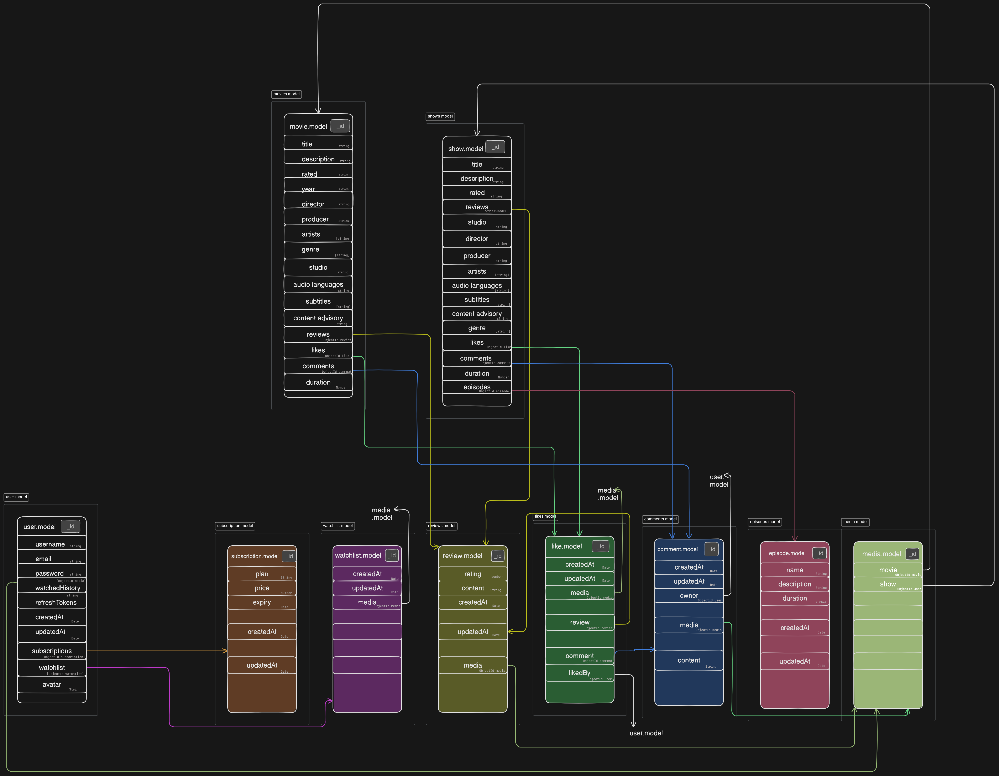

# Schema Documentation
- Model link - [Do checkout](https://app.eraser.io/workspace/rPYaoaqlntkQMFml7Rjz?origin=share)

## Overview
This document provides an overview of the schema used to store user information, movie info, shows info and other related data required for an entertainment web app. The schema includes several collections, each with specific fields and relationships.

## Collections
### User
The `Users` collection stores information about the users.

#### Fields
- **username** (String, Required): The unique username of the user.
- **email** (String, Required, Indexed): The email address of the user. Must be in a valid email format.
- **password** (String, Required): The password for the user's account.
- **subscription**([ObjectId subscription]): The subscription plans user has subscribed to.
- **watchedHistory**([ObjectId media]): List of shows and movies user has watched recently.
- **avatar**(String) : User profile image.
#### Relationships
- **One-to-One**: Each user has one profile.
- **One-to-Many**: Each user can watch multiple media (shows and movies).
### Movie
The `Movie` collection stores movies on our platform.

#### Fields
- **title** (String, Required): Title of the movie.
- **description** (String, Required): Description of the movie.
- **rated** (String, Required): Which audience is movie suitable for. (U, R, A etc.)
- **review** ([ObjectId review]): Array of reviews on the movie.
- **comment** ([ObjectId comment]): The comment provided by the user.
- **year**(String, Required): The year of release.
- **director** (String, Required)
- **producer**(String, Required)
- **artists**([String], Required)
- **genre**([String], Required) 
- **studio**(String, Required) 
- **audioLanguages**([String], Required) : Language of the film.
- **subtitles** ([String], Required) : Array of languages in which subtitles are available.
- **contentAdvisory**(String, Required)
- **likes** (ObjectId like)
- **duration**(Number, Required)
### Show
The `show` collection stores information about shows.

#### Fields
- **title** (String, Required): Title of the show.
- **description** (String, Required): Description of the movie.
- **rated** (String, Required): Which audience is show suitable for. (U, R, A etc.)
- **review** ([ObjectId review]): Array of reviews on the show.
- **comment** ([ObjectId comment]): The comment provided by the user.
- **year**(String , Required): The year of release.
- **director** (String, Required)
- **producer**(String, Required)
- **artists**([String], Required)
- **genre**([String], Required) 
- **studio**(String, Required) 
- **audioLanguages**([String], Required) : Language of the film.
- **subtitles** ([String], Required) : Array of languages in which subtitles are available.
- **contentAdvisory**(String, Required)
- **likes** (ObjectId like)
- **duration**(Number, Required)
- **episodes**(ObjectId episode)
### Media
The `Media` collection can store object of both Movie collection and Show collection.

#### Fields
- **Movie** (ObjectId movie)
- **Show** (ObjectId show)
## Indexes
- **Users Collection**: An index is defined on the `username`  field.
- **Movie Collection**: An index is defined on the `title`  field.
- **Shows Collection:**An index is defined on the `title`  field.
## Validation Rules
- **Users Collection**: The `email`  field must be in a valid email format.
## Relationships Summary
- **Users to Profiles**: One-to-One
- **Users to Media**: One-to-Many
- **Media to Reviews**: One-to-Many
## Conclusion
This schema is designed to efficiently store and manage user information, media details, reviews, likes and comments with appropriate relationships and validation rules to ensure data integrity.

